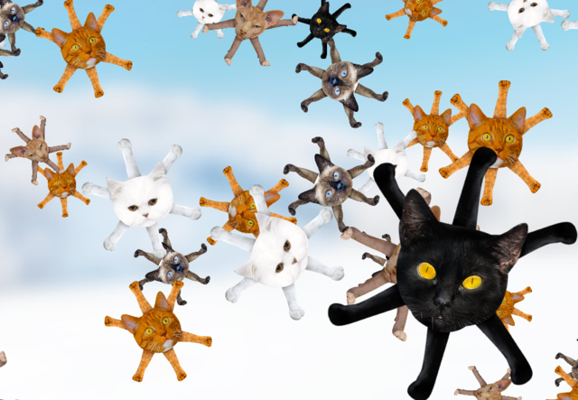

# nixCats

### For the Lua‑natic’s Neovim config on Nix

*nixCats* is a light‑weight Neovim **package manager written in Nix**.  
It lets Nix handle every download and build step while you keep writing a plain‑old Lua config.

---

## 1. Why use it?

* **Stay in Lua** – keep your familiar directory layout (`init.lua`, `lua/…`)  
* **Pure & reproducible** – Nix downloads plugins, LSPs, build tools, even fonts  
* **One file to rule them all** – describe plugins & tools in a single `flake.nix`  
* **Zero Lua‑inside‑Nix strings** – pass values to Lua with `nixCats('key')`  
* **Switchable run‑modes** – frozen build in the Nix store *or* live‑reload (`wrapRc = false`)  

---

## 2. How does it work?

```text
flake.nix ─► categoryDefinitions  ▸ lists of plugins / deps
            packageDefinitions   ▸ which categories each “nvim” package gets
            settings             ▸ wrapRc, aliases, etc.
```

1. **Define categories** (startup plugins, optional plugins, LSPs, …) once.  
2. **Enable** any combination per package (e.g. `nvim`, `nvim‑go`, `nvim‑minimal`).  
3. **Read in Lua** with the helper:

```lua
-- in init.lua or any plugin config
if nixCats('go') then
  require('lspconfig').gopls.setup({})
end

vim.cmd('colorscheme ' .. nixCats('colorscheme'))
```

---

## 3. At a glance

| Feature                       | nixCats | Mason/lazy.nvim | NixVim / nvf |
|-------------------------------|:-------:|:---------------:|:------------:|
| Pure, reproducible installs   | ✅      | ❌ (imperative) | ✅ |
| Lua‑centric config            | ✅      | ✅              | ❌ (Nix files) |
| Works on NixOS                | ✅      | ⚠️ extra steps  | ✅ |
| No Lua‑in‑Nix strings         | ✅      | —               | — |

---

## 4. Try it now

```bash
# One‑off shell with the example config
nix run github:BirdeeHub/nixCats-nvim?dir=templates/example

# Scaffold your own repo (flake + skeleton dirs)
nix flake init -t github:BirdeeHub/nixCats-nvim
```

Next stop → **Getting Started**.
